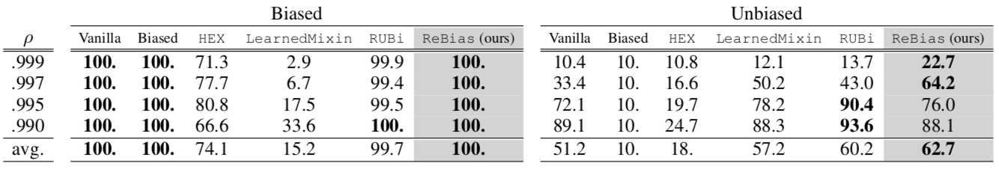

## Learning De-biased Representations with Biased Representations (ICML 2020)

Official Pytorch implementation of **ReBias** | [Paper](https://arxiv.org/abs/1910.02806)

Hyojin Bahng<sup>1</sup>, Sanghyuk Chun<sup>2</sup>, Sangdoo Yun<sup>2</sup>, Jaegul Choo<sup>3</sup>, Seong Joon Oh<sup>2</sup>

<sup>1</sup> <sub>Korea university</sub>  
<sup>2</sup> <sub>Clova AI Research, NAVER Corp.</sub>  
<sup>3</sup> <sub>KAIST</sub>

Many machine learning algorithms are trained and evaluated by splitting data from a single source into training and test sets. While such focus on *in-distribution* learning scenarios has led to interesting advancement, it has not been able to tell if models are relying on dataset biases as shortcuts for successful prediction (*e.g.*, using snow cues for recognising snowmobiles), resulting in biased models that fail to generalise when the bias shifts to a different class. The *cross-bias generalisation* problem has been addressed by de-biasing training data through augmentation or re-sampling, which are often prohibitive due to the data collection cost (*e.g.*, collecting images of a snowmobile on a desert) and the difficulty of quantifying or expressing biases in the first place. In this work, we propose a novel framework to train a de-biased representation by encouraging it to be *different* from a set of representations that are biased by design. This tactic is feasible in many scenarios where it is much easier to define a set of biased representations than to define and quantify bias. We demonstrate the efficacy of our method across a variety of synthetic and real-world biases; our experiments show that the method discourages models from taking bias shortcuts, resulting in improved generalisation. 

## Updates

- **26 Jun, 2020**: Initial upload.

## Summary of code contributions

The code repository contains the implementations of our method (**ReBias**) as well as prior de-biasing methods empirically compared in the paper. Specifically, we provide codes for:

- **ReBias** (ours): Hilbert Schmidt Independence Criterion (HSIC) based minimax optimization. See [criterions/hsic.py](criterions/hsic.py)
- **Vanilla** and **Biased** architectures. See [models/mnist\_models.py](models/mnist_models.py), [models/imagenet\_models.py](models/imagenet_models.py), and [models/action\_models/ResNet3D.py](models/action_models/ResNet3D.py).
- **Learned Mixin** ([1] Clark, et al. 2019): [criterions/comparison\_methods.py](criterions/comparison_methods.py)
- **RUBi** ([2] Cadene, et al. 2019): [criterions/comparison\_methods.py](criterions/comparison_methods.py)

We support training and evaluation of above methods on the three diverse datasets and tasks. See [trainer.py](trainer.py) and [evaluator.py](evaluator.py) for the unified framework. Supported datasets and tasks are:

- **Biased MNIST** (Section 4.2): [main\_biased\_mnist.py](main_biased_mnist.py) and [datasets/colour\_mnist.py](datasets/colour\_mnist.py)
- **ImageNet** (Section 4.3): [main\_imagenet.py](main_imagenet.py), [datasets/imagenet.py](datasets/imagenet.py) and [make\_clusters.py](make_clusters.py)
- **Action recognition** (Section 4.4): [main\_action.py](main_action.py) and [datasets/kinetics.py](datasets/kinetics.py)

In this implementation, we set `Adam` as the default optimiser for the reproducibility. However, we strongly recommend using a better optimiser `AdamP` [3] by `--optim AdamP` for future researches. We refer [the official repository of AdamP](https://github.com/clovaai/adamp) for interested users.

## Installation

### MNIST and ImageNet experiments

Our implementations are tested on the following libraries with Python3.7.

```
fire
munch
torch==1.1.0
torchvision==0.2.2.post3
adamp
```

Install dependencies using the following command.

```bash
pip install -r requirements.txt
```

### Action recognition experiments

For action recoginition tasks, we implement the baselines upon the [official implementation of SlowFast](https://github.com/facebookresearch/SlowFast).

**NOTE: We will not handle the issues from action recognition experiments.**

Please follow the official SlowFast instruction:
https://github.com/facebookresearch/SlowFast/blob/master/INSTALL.md

## Dataset preparation

### Biased MNIST

Biased MNIST is a colour-biased version of the original MNIST. [datasets/colour\_mnist.py](datasets/colour_mnist.py) downloads the original MNIST and applies colour biases on images by itself. No extra preparation is needed on the user side.

### ImageNet

We do not provide a detailed instruction for collecting the ImageNet (ILSVRC2015) dataset.
Please follow the usual practice.

#### ImageNet-A and ImageNet-C

To further measure the generalisability of de-biasing methods, we perform evaluations on the ImageNet-A ([4] Hendrycks, et al. 2019) and ImageNet-C ([5] Hendrycks, et al. 2019) as well. The datasets are available at https://github.com/hendrycks/natural-adv-examples and https://github.com/hendrycks/robustness, respectively.

NOTE: We implement the ImageNet-C evaluator separately to this implementation, and do not provide the implementation here. Please refer to [5] for details.

### Kinetics and Mimetics

We use two datasets for action recognition: Kinetics and Mimetics ([6] Weinzaepfel, et al. 2019).

Kinetics and Mimetics datasets are available at:

- Kinetics: https://github.com/facebookresearch/SlowFast/blob/master/slowfast/datasets/DATASET.md
- Mimetics: https://europe.naverlabs.com/research/computer-vision/mimetics/

**NOTE: We will not handle the issues from action recognition experiments.**

## How to run

### Biased MNIST results in Table 1



Main experiments for the Biased MNIST are configured in [main\_biased\_mnist.py](main_biased_mnist.py).
Note that we have reported the average of three runs in the main paper; the standard deviations are reported in the appendix.

NOTE: We do not provide HEX [7] implementation which is significantly different from the other baselines. It does not require any biased model but containes pre-defined handcrafted feature extractor named NGLCM. Thus, instead of providing HEX under the unified framework, we have implemented it separately. Please refer to [official HEX implementation](https://github.com/HaohanWang/HEX) for details.

#### ReBias (ours)

For the better results with AdamP
```bash
python main_biased_mnist.py --root /path/to/your/dataset
    --train_correlation 0.999 --optim AdamP

python main_biased_mnist.py --root /path/to/your/dataset
    --train_correlation 0.997 --optim AdamP

python main_biased_mnist.py --root /path/to/your/dataset
    --train_correlation 0.995 --optim AdamP

python main_biased_mnist.py --root /path/to/your/dataset
    --train_correlation 0.99 --optim AdamP
```

For the original numbers,
```bash
python main_biased_mnist.py --root /path/to/your/dataset
    --train_correlation 0.999

python main_biased_mnist.py --root /path/to/your/dataset
    --train_correlation 0.997

python main_biased_mnist.py --root /path/to/your/dataset
    --train_correlation 0.995

python main_biased_mnist.py --root /path/to/your/dataset
    --train_correlation 0.99
```

#### Vanilla & Biased

By setting `f_lambda_outer` and `g_lambda_inner` to 0, f and g are trained separately without minimax optimization.

```bash
python main_biased_mnist.py --root /path/to/your/dataset
    --train_correlation 0.999
    --f_lambda_outer 0
    --g_lambda_inner 0

python main_biased_mnist.py --root /path/to/your/dataset
    --train_correlation 0.997
    --f_lambda_outer 0
    --g_lambda_inner 0

python main_biased_mnist.py --root /path/to/your/dataset
    --train_correlation 0.995
    --f_lambda_outer 0
    --g_lambda_inner 0

python main_biased_mnist.py --root /path/to/your/dataset
    --train_correlation 0.99
    --f_lambda_outer 0
    --g_lambda_inner 0
```

#### Learned Mixin

In our experiments, we first pretrain g networks for the Learned Mixin and optimize F using the fixed g.
Hence, `n_g_pretrain_epochs` and `n_g_update` are set to 5 and 0, respectively.

```bash
python main_biased_mnist.py --root /path/to/your/dataset
    --train_correlation 0.999
    --outer_criterion LearnedMixin
    --g_lambda_inner 0
    --n_g_pretrain_epochs 5
    --n_g_update 0

python main_biased_mnist.py --root /path/to/your/dataset
    --train_correlation 0.997
    --outer_criterion LearnedMixin
    --g_lambda_inner 0
    --n_g_pretrain_epochs 5
    --n_g_update 0

python main_biased_mnist.py --root /path/to/your/dataset
    --train_correlation 0.995
    --outer_criterion LearnedMixin
    --g_lambda_inner 0
    --n_g_pretrain_epochs 5
    --n_g_update 0

python main_biased_mnist.py --root /path/to/your/dataset
    --train_correlation 0.99
    --outer_criterion LearnedMixin
    --g_lambda_inner 0
    --n_g_pretrain_epochs 5
    --n_g_update 0
```

#### RUBi

RUBi updates F and g simultaneously but separately.
We set `g_lambda_inner` to 0 for only updating g network using the classification loss.

```bash
python main_biased_mnist.py --root /path/to/your/dataset
    --train_correlation 0.999
    --outer_criterion RUBi
    --g_lambda_inner 0

python main_biased_mnist.py --root /path/to/your/dataset
    --train_correlation 0.997
    --outer_criterion RUBi
    --g_lambda_inner 0

python main_biased_mnist.py --root /path/to/your/dataset
    --train_correlation 0.995
    --outer_criterion RUBi
    --g_lambda_inner 0

python main_biased_mnist.py --root /path/to/your/dataset
    --train_correlation 0.99
    --outer_criterion RUBi
    --g_lambda_inner 0
```

### ImageNet results in Table 2

| Model                 | Biased (Standard acc) | Unbiased (Texture clustering) | ImageNet-A [4] |
|-----------------------|-----------------------|-------------------------------|----------------|
| Vanilla (ResNet18)    | 90.8                  | 88.8                          | 24.9           |
| Biased (BagNet18)     | 67.7                  | 65.9                          | 19.5           |
| Stylised ImageNet [8] | 88.4                  | 86.6                          | 24.6           |
| LearnedMixin [1]      | 67.9                  | 65.9                          | 18.8           |
| RUBi [2]              | 90.5                  | 88.6                          | 27.7           |
| ReBias (ours)         | **91.9**              | **90.5**                      | **29.6**       |

Main experiments for ImageNet are configured in `main_imagenet.py` .
Note that we have reported the average of three runs in the main paper; the standard deviations are reported in the appendix.

#### ReBias (ours)

Our default settings to kernel radius for HSIC is median, which need to compute pair-wise distances in training dataset.
We set the kernel radius by median of the distances. Thus, `rbf_sigma_x` and `rbf_sigma_y` are set to `median`, and we recompute the kernel radius for every epoch.

To aviod unnecessary computations, we set `rbf_sigma_x` and `rbf_sigma_y` to 1 for other methods.

```bash
python main_imagenet.py --train_root /path/to/your/imagenet/train
    --val_root /path/to/your/imagenet/val
    --imageneta_root /path/to/your/imagenet_a
    --optim AdamP
```

For the original numbers,
```bash
python main_imagenet.py --train_root /path/to/your/imagenet/train
    --val_root /path/to/your/imagenet/val
    --imageneta_root /path/to/your/imagenet_a
```

#### Vanilla & Biased

```bash
python main_imagenet.py --train_root /path/to/your/imagenet/train
    --val_root /path/to/your/imagenet/val
    --imageneta_root /path/to/your/imagenet_a
    --f_lambda_outer 0
    --g_lambda_inner 0
    --rbf_sigma_x 1
    --rbf_sigma_y 1
```

#### Learned Mixin

```bash
python main_imagenet.py --train_root /path/to/your/imagenet/train
    --val_root /path/to/your/imagenet/val
    --imageneta_root /path/to/your/imagenet_a
    --outer_criterion LearnedMixin
    --n_g_pretrain_epochs 30
    --n_g_update 0
    --rbf_sigma_x 1
    --rbf_sigma_y 1
```

#### RUBi

```bash
python main_imagenet.py --train_root /path/to/your/imagenet/train
    --val_root /path/to/your/imagenet/val
    --imageneta_root /path/to/your/imagenet_a
    --outer_criterion RUBi
    --g_lambda_inner 0
    --rbf_sigma_x 1
    --rbf_sigma_y 1
```

#### Stylised ImageNet

We train Stylised ImageNet by training the vanilla model with the original ImageNet train dataset and the stylised train dataset (IN + SIN in [8]).
Please follow the instruction in the following repositories to build the stylised ImageNet training dataset.

- https://github.com/rgeirhos/Stylized-ImageNet
- https://github.com/bethgelab/stylize-datasets

Run the following command

```bash
python main_imagenet.py --train_root /path/to/your/imagenet_and_stylised_imagenet/train
    --val_root /path/to/your/imagenet/val
    --imageneta_root /path/to/your/imagenet_a
    --f_lambda_outer 0
    --g_lambda_inner 0
```

Note that the command is identical to the **Vanilla & Biased** case, except that the training set is now replaced by the Stylized ImageNet.

### Action recognition results in Table 3

**NOTE: We will not handle the issues from action recognition experiments.**

| Model               | Biased (Kinetics) | Unbiased (Mimetics) [6] |
|---------------------|-------------------|-------------------------|
| Vanilla (3D-ResNet) | 54.5              | 18.9                    |
| Biased (2D-ResNet)  | 50.7              | 18.4                    |
| LearnedMixin [1]    | 11.4              | 12.3                    |
| RUBi [2]            | 23.6              | 13.4                    |
| ReBias (ours)       | **55.8**          | **22.4**                |

#### ReBias (ours)

```bash
python main_action.py --train_root /path/to/your/kinetics/train
    --train_annotation_file /path/to/your/kinetics/train_annotion
    --eval_root /path/to/your/mimetics/train
    --eval_annotation_file /path/to/your/kinetics/train_annotion
```

#### Learned Mixin

```bash
python main_action.py --train_root /path/to/your/kinetics/train
    --train_annotation_file /path/to/your/kinetics/train_annotion
    --eval_root /path/to/your/mimetics/train
    --eval_annotation_file /path/to/your/kinetics/train_annotion
    --outer_criterion LearnedMixin
    --n_g_pretrain_epochs 30
    --n_g_update 0
    --rbf_sigma_x 1
    --rbf_sigma_y 1 
```

#### RUBi

```bash
python main_action.py --train_root /path/to/your/kinetics/train
    --train_annotation_file /path/to/your/kinetics/train_annotion
    --eval_root /path/to/your/mimetics/train
    --eval_annotation_file /path/to/your/kinetics/train_annotion
    --outer_criterion RUBi
    --g_lambda_inner 0
    --rbf_sigma_x 1
    --rbf_sigma_y 1
```

## License

This project is distributed under [MIT license](LICENSE).

```
Copyright (c) 2020-present NAVER Corp.

Permission is hereby granted, free of charge, to any person obtaining a copy
of this software and associated documentation files (the "Software"), to deal
in the Software without restriction, including without limitation the rights
to use, copy, modify, merge, publish, distribute, sublicense, and/or sell
copies of the Software, and to permit persons to whom the Software is
furnished to do so, subject to the following conditions:

The above copyright notice and this permission notice shall be included in
all copies or substantial portions of the Software.

THE SOFTWARE IS PROVIDED "AS IS", WITHOUT WARRANTY OF ANY KIND, EXPRESS OR
IMPLIED, INCLUDING BUT NOT LIMITED TO THE WARRANTIES OF MERCHANTABILITY,
FITNESS FOR A PARTICULAR PURPOSE AND NONINFRINGEMENT.  IN NO EVENT SHALL THE
AUTHORS OR COPYRIGHT HOLDERS BE LIABLE FOR ANY CLAIM, DAMAGES OR OTHER
LIABILITY, WHETHER IN AN ACTION OF CONTRACT, TORT OR OTHERWISE, ARISING FROM,
OUT OF OR IN CONNECTION WITH THE SOFTWARE OR THE USE OR OTHER DEALINGS IN
THE SOFTWARE.
```

## How to cite

```
@inproceedings{bahng2019rebias,
    title={Learning De-biased Representations with Biased Representations},
    author={Bahng, Hyojin and Chun, Sanghyuk and Yun, Sangdoo and Choo, Jaegul and Oh, Seong Joon},
    year={2020},
    booktitle={International Conference on Machine Learning (ICML)},
}
```

## References

- [1] Clark, C., Yatskar, M., and Zettlemoyer, L. Don’t take the easy way out: Ensemble based methods for avoiding known dataset biases. EMNLP, 2019.
- [2] Cadene, R., Dancette, C., Cord, M., Parikh, D., et al. Rubi: Reducing unimodal biases for visual question answering. In Advances in Neural Information Processing Systems, 2019.
- [3] Heo, B., Chun, S., Oh, S. J., Han, D., Yun, S., Uh, Y., and Ha, J. W. Slowing Down the Weight Norm Increase in Momentum-based Optimizers. arXiv preprint arXiv:2006.08217, 2020.
- [4] Hendrycks, D., Zhao, K., Basart, S., Steinhardt, J., and Song, D. Natural adversarial examples. arXiv preprint arXiv:1907.07174, 2019.
- [5] Hendrycks, D., Dietterich, T. Benchmarking Neural Network Robustness to Common Corruptions and Perturbations. ICLR, 2019.
- [6] Weinzaepfel, P. and Rogez, G. Mimetics: Towards understanding human actions out of context. arXiv preprint arXiv:1912.07249, 2019.
- [7] Wang, H., He, Z., and Xing, E. P. Learning robust representations by projecting superficial statistics out. In International Conference on Learning Representations, 2019.
- [8] Geirhos, R., Rubisch, P., Michaelis, C., Bethge, M., Wichmann, F. A., and Brendel, W. Imagenet-trained CNNs are biased towards texture; increasing shape bias improves accuracy and robustness. In International Conference on Learning Representations, 2019.
